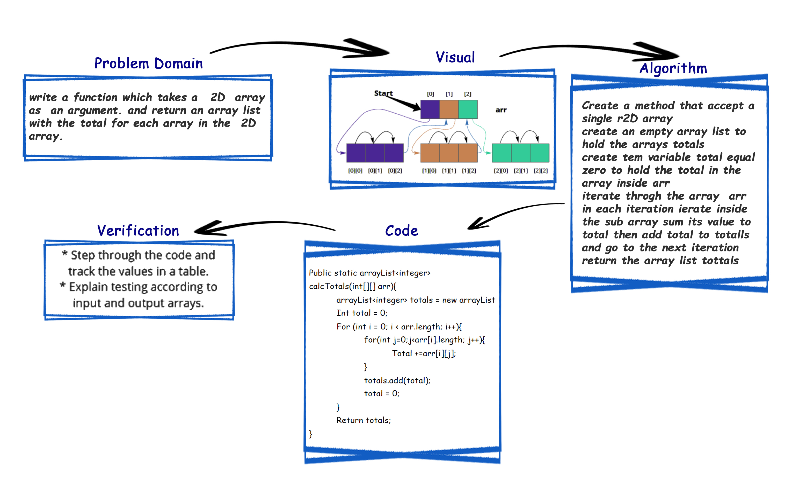

# Array Reverse

     sum array list Without utilizing any of the built-in methods available

## Challenge

     write a function which takes a 2D  array as  an argument. and return an array list with the total for each array in the 2D array  

## Approach & Efficiency / Algorithm

- Create a method that accept a single r2D array
- create an empty array list to hold the arrays totals
- create tem variable total equal zero to hold the total in the array inside arr
- iterate throgh the array  arr
- in each iteration ierate inside the sub array sum its value to total then add total to totalls and go to the next iteration
- return the array list tottals

## Solution

