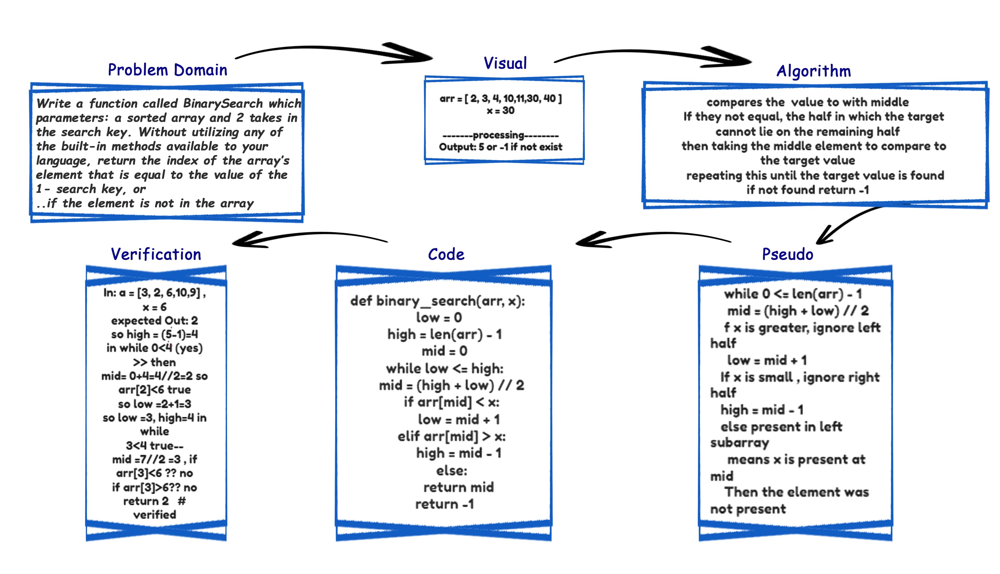

# array-binary-search

Binary search in a sorted 1D array

- - -

## Challenge:-

function called BinarySearch takes 2 params: a sorted array and the search key.

## Approach & Efficiency:

making a while loop an comparasin

## Solution

