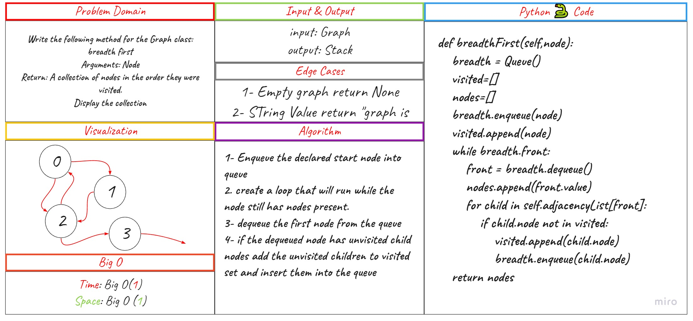

# Graph Breadth First

## Challenge Summary

Implement a breadth-first traversal on a graph.

Write the following method for the Graph class:

breadth first
Arguments: Node
Return: A collection of nodes in the order they were visited.
Display the collection

## Whiteboard Process

## Efficiency

Time Big O(1)
Space Big O(1)

## Solution

- code : [py](./graph_breadth_first/code.py)

- test : [py](./tests/test_graph_breadth_first.py)
