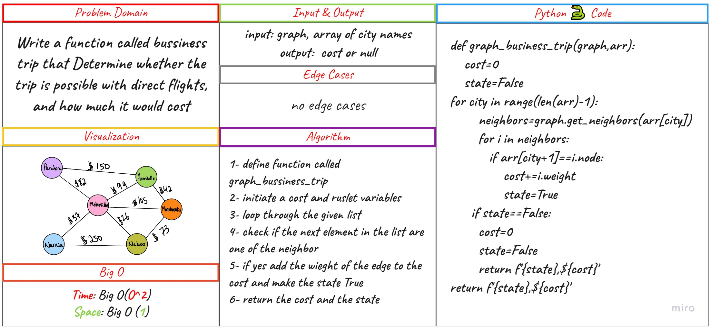
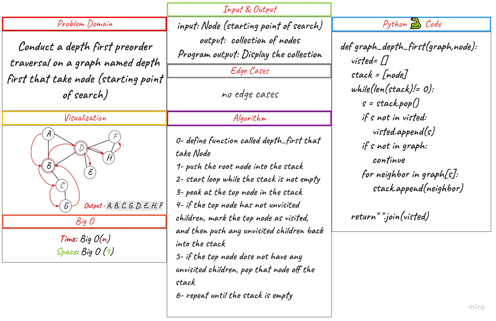

# Graph Depth First

## Challenge Summary

Conduct a depth first preorder traversal on a graph

## Whiteboard Process

### code challenge 37

### code challenge 38

## Approach

- Write the following method for the Graph class:

0. Name: Depth first
1. Arguments: Node (Starting point of search)
2. Return: A collection of nodes in their pre-order depth-first traversal order
3. Program output: Display the collection

## Solution

- code : [py](./graph_depth_first/code.py)

- test : [py](./tests/test_graph_depth_first.py)
