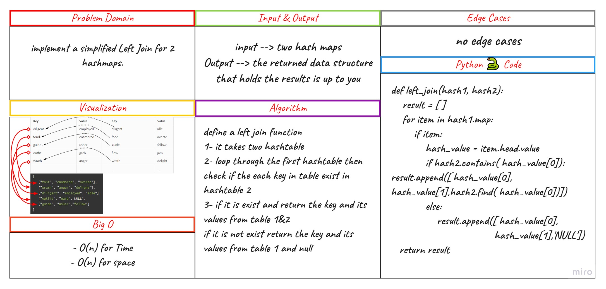

# Challenge Summary

Implement a simplified LEFT JOIN for 2 Hashmaps.

## Whiteboard Process

## Approach & Efficiency

Write a function called left join

1. Arguments: two hash maps
2. The first parameter is a hashmap that has word strings as keys, and a synonym of the key as values.
3. The second parameter is a hashmap that has word strings as keys, and antonyms of the key as values.
4. Return: The returned data structure that holds the results is up to you. It doesn’t need to exactly match the output below, so long as it achieves the LEFT JOIN logic

## Efficiency

- O(n) for Time
- O(n) for space

## Solution

- code : [py](./hashmap_left_join/code.py)

- test : [py](./tests/test_hashmap_left_join.py)
