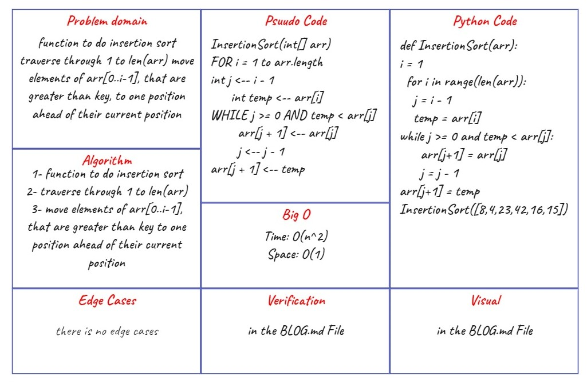

# Challenge Summary CC26

Insertion Sort

## Challenge Summary

- [x] Review the pseudocode below
- [x] trace the algorithm by stepping through the process with the provided sample array.
- [x] Document your explanation by creating a blog article that shows the step-by-step output after each iteration through some sort of visual.
- [x] Provide a visual step through for each of the sample arrays based on the provided pseudo code
- [x] Convert the pseudo-code into working code in your language
- [x] Present a complete set of working tests

## Efficiency
<!-- What is the Big O space/time for this approach? -->

following the Pseudocode

## Whiteboard Process
<!-- Embedded whiteboard image -->

## Solution
<!-- Show how to run your code, and examples of it in action -->
### ▶ [BLOG](./assets/BLOG.md)
