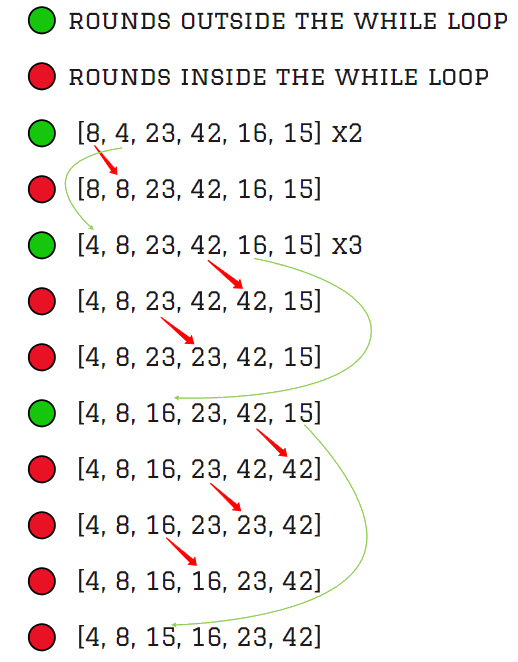

# Insertion Sort

Simple sorting algorithm that works similar to the way you sort playing cards in your hands.
The array is virtually split into a sorted and an unsorted part.
Values from the unsorted part are picked and placed at the correct position in the sorted part.

## Pseudocode

```py
  InsertionSort(int[] arr)

    for i = 1 to arr.length

      int j <-- i - 1
      int temp <-- arr[i]

      while j >= 0 and temp < arr[j]
        arr[j + 1] <-- arr[j]
        j <-- j - 1

      arr[j + 1] <-- temp
```

## The list

arr = `[8,4,23,42,16,15]`

## Trace it



steps:

- [x] start from index0 first element in the array(8)
- [x] the next is array(4)
- [x] 4 smaller than 8 so we swap them.

**then**:

- [x] take the third element array (23)
- [x] 23 bigger than 8 so we keep it in same place .

**then**:

- [x] take the fourth element array (42):
- [x] 42 bigger than 23 so we keep it in same place .

**then**:

- [x] take the fifth element array(16)
- [x]  16 smaller then 42 so we swap them until its become bigger then an element..

**then**:

- [x] as pass 4 , take the sixth element array(15)in the array , smaller than 16 so we can swap them an so on until we git the correct sort

sorted_array = [4,8,15,16,23,42]

**Time**: O(n^2)
**Space**: O(1)
