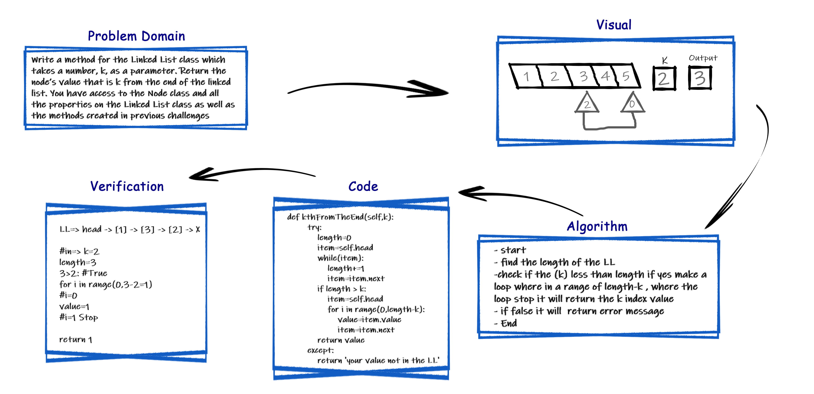

# Challenge Summary
<!-- Description of the challenge -->
Given a Linked List and a number n, write function returns the value at the n’th node from the end of the Linked List.

## Whiteboard Process
<!-- Embedded whiteboard image -->


## Approach & Efficiency
<!-- What approach did you take? Why? What is the Big O space/time for this approach? -->
Maintain two pointers – reference pointer and main pointer. Initialize both reference and main pointers to head. First, move the reference pointer to n nodes from head. Now move both pointers one by one until the reference pointer reaches the end. Now the main pointer will point to nth node from the end. Return the main pointer.

efficiency =O(n)

## Solution
<!-- Show how to run your code, and examples of it in action -->

```py
    def kthFromEnd(self,k):
        count, Current = 0, self.head
        while Current.next is not  None:
            count+=1
            Current=Current.next
        k_value=count-k ; Current =self.head
        if k_value >=0:
            for i in range(k_value+1):
                value, Current = Current.value, Current.next
            return value
        else: raise Exception('value dose not exisit  ')   
```

[python file](./linked_list_insertions/linked_list.py)
