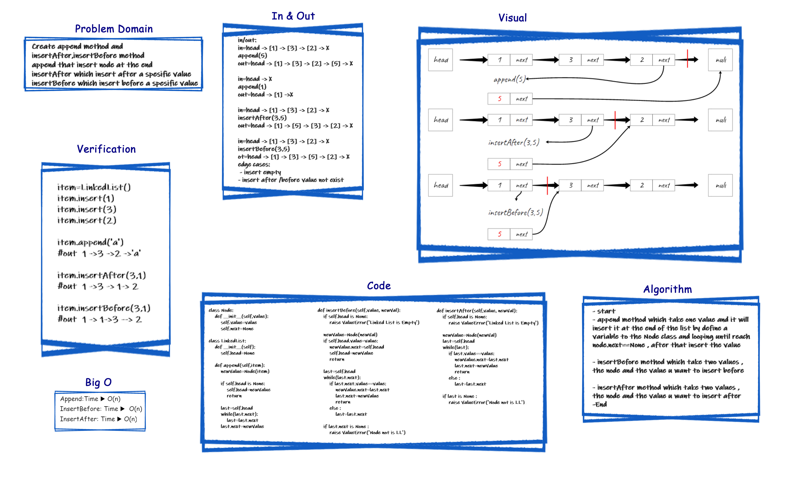

# Challenge Summary
<!-- Description of the challenge -->
- Write methods for the Linked List class:

.append(value) new node with the given value to the end of the list.
insertBefore(value, newVal) which add a new node with the given newValue immediately before the first value node.
insertAfter(value, newVal) which add a new node with the given newValue immediately after the first value node.

## Whiteboard Process
<!-- Embedded whiteboard image -->


## Approach & Efficiency
<!-- What approach did you take? Why? What is the Big O space/time for this approach? -->
append:iterate over the linked list then add the value.
insertBefore: create new node,find target node to insert,search nodes,add the new node.
insertAfter:create a new node ,iterate over the ll to find the target and insert the node.

append: O(n) insertBefore: O(n) insertAfter:O(n)

## Solution
<!-- Show how to run your code, and examples of it in action -->

```py
    def append(self, value):
        newNode = Node(value)
        if self.head == None:
            self.head = newNode
        else:
            current = self.head
            while current.next:
                current = current.next
            current.next = Node(value)

    def insertBefore(self,value,newVal):
        current = self.head
        while current.next is not None:
            if current.next.value == value:
                break
            current = current.next
        if current.next is None: raise Exception("the value not exisit ")
        else:
            newNode = Node(newVal)
            newNode.next = current.next
            current.next = newNode

    def insertAfter(self,value,newVal):
        current = self.head
        while current is not None:
            if current.value == value:
                break
            current = current.next
        if current is None:
            raise Exception(" the value not exisit ")
        else:
            newNode = Node(newVal)
            newNode.next = current.next
            current.next = newNode
```

[python file](./linked_list_insertions/linked_list.py)
