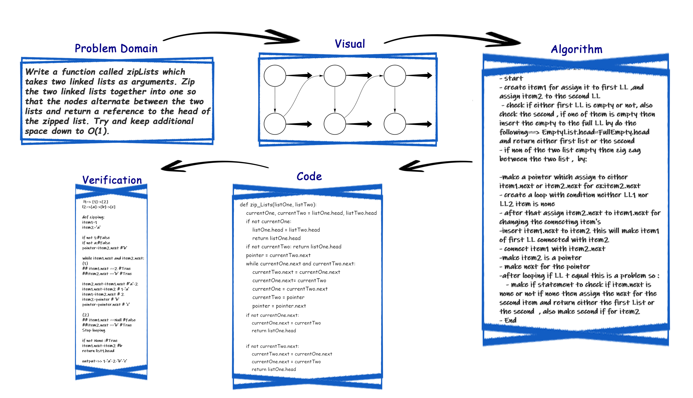

# Challenge Summary

Write a function called zipLists which takes two linked lists as arguments. Zip the two linked lists together into one so that the nodes alternate between the two lists and return a reference to the head of the zipped list. Try and keep additional space down to O(1).

## Approach & Efficiency

learned about LinkedList how to deal with it and traversed throw it

Big O
time => O(n)
space => O(1)

## Whiteboard Process & Solution



```py
if __name__ == "__main__":
    llOne, llTwo = Linkedlist(), Linkedlist()
    llOne.append(10) ; llOne.append(34)
    llTwo.append(42) ; llTwo.append(54)
    llTwo.append(57) ; llTwo.append(64)
    print(llOne.__str__()) ; print(llTwo.__str__())
    zip_Lists(llOne,llTwo) ; print(llOne.__str__())
```

[ch08 code file](../linked_list_insertions/ll_zip.py)

### Time Take

8:00 pm - 11:15pm
