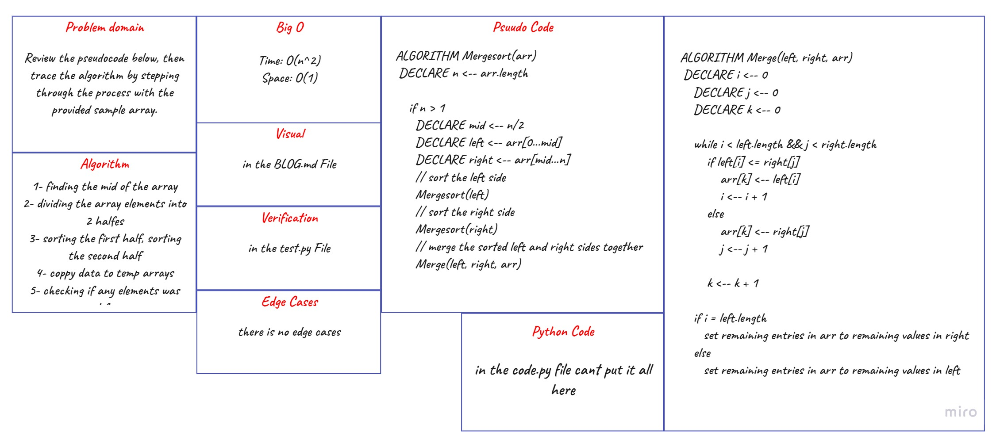

# MergSort

- sorting array

## Challenge

- [x] Review the pseudocode below
- [x] trace the algorithm by stepping through the process with the provided sample array.
- [x] Document your explanation by creating a blog article that shows the step-by-step output after each iteration through some sort of visual.

## Approach & Efficiency

following the Pseudocode

## Solution

- BLOG :[md file](./assets/BLOG.md)

- code : [py](./merge_sort/code.py)
