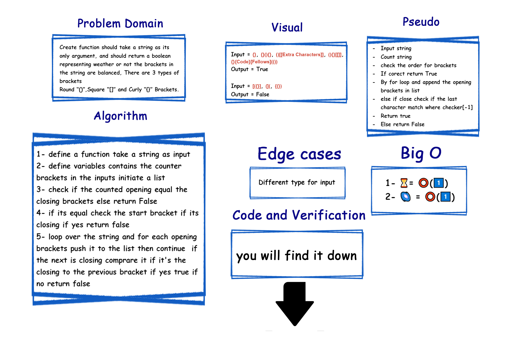

# Challenge Summary
<!-- Description of the challenge -->
Create function should *take* a **string** as its only argument, and should *return* a **boolean** representing weather or not the **brackets** in the string *are* **balanced**, There are 3 *types* of **brackets**:
**Round** `()`,**Square** `[]`, and **Curly** `{}` Brackets.

## Efficiency
<!-- What approach did you take? Why? What is the Big O space/time for this approach? -->

- [x] ⏳= ⭕(1️⃣)
- [x] 🌌 = ⭕(1️⃣)

## Whiteboard Process
<!-- Embedded whiteboard image -->

## Solution
<!-- Show how to run your code, and examples of it in action -->
### ▶ [Code](./stack_queue_brackets/brackets.py)

### ▶ [Verification](./tests/test_stack_queue_brackets.py)
