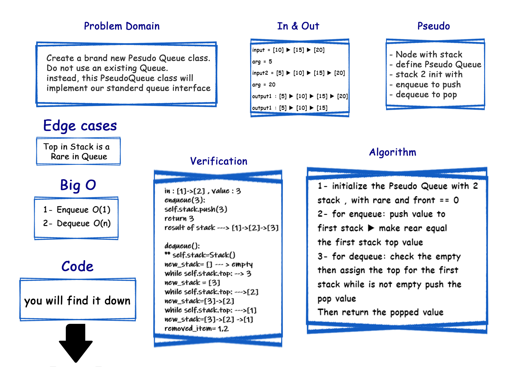

# Queue With Stacks Challenge Summary
<!-- Description of the challenge -->
- implement  a Queue using two Stacks.

## Approach & Efficiency
<!-- What approach did you take? Why? What is the Big O space/time for this approach? -->

1. Create a brand new PseudoQueue class.
2. enqueue(value) which inserts value into the PseudoQueue, using a first-in, first-out approach.
3. dequeue() which extracts a value from the PseudoQueue, using a first-in, first-out approach.

- [x] Enqueue O(1)
- [x] Dequeue O(n)

## Whiteboard Process
<!-- Embedded whiteboard image -->

## Solution
<!-- Show how to run your code, and examples of it in action -->
### ▶ [Code](./stack_queue_pseudo/)
