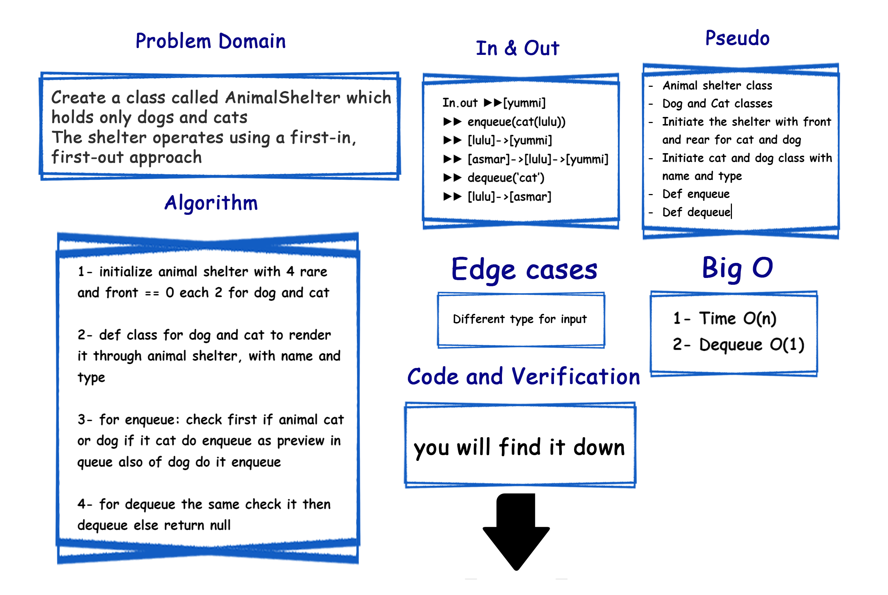

# Challenge Summary
<!-- Description of the challenge -->
Create a class called **AnimalShelter** which *holds* only **dogs** and **cats**.
The shelter operates using a **first-in**, **first-out** approach.

**methods**:

- enqueue:
  - **Arguments**: `animal` can be either a dog or a cat object.

- dequeue:
  - **Arguments**: `pref` can be either `"dog"` or `"cat"`
  - Return: either a dog or a cat, based on preference
    - If `pref` is not `"dog"` or `"cat"` then return **null**.

## Efficiency

- [x] Time O(n)
- [x] Dequeue O(1)

## Whiteboard Process
<!-- Embedded whiteboard image -->

## Solution
<!-- Show how to run your code, and examples of it in action -->
### ▶ [Code](./stack_queue_animal_shelter/fifo_animal_shelter.py)

### ▶ [Verification](./tests/test_stack_queue_animal_shelter.py)
