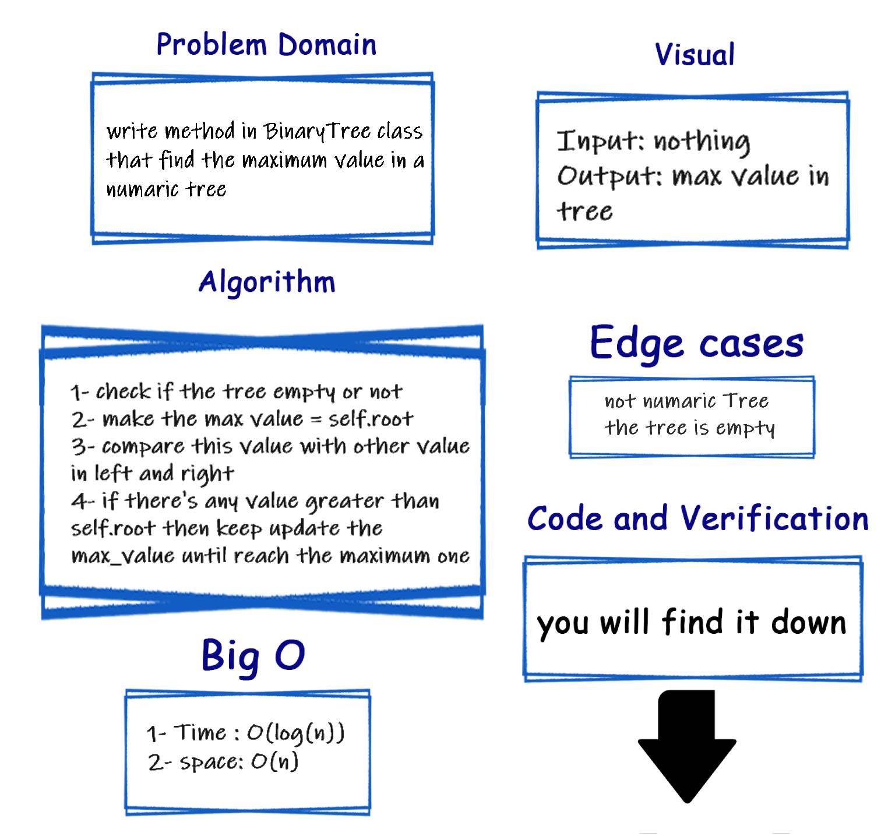

# Challenge Summary
<!-- Description of the challenge -->
Write the following method for the Binary Tree class

find maximum value
Arguments: none
Returns: number
Find the maximum value stored in the tree. You can assume that the values stored in the Binary Tree will be numeric.

## Efficiency
<!-- What approach did you take? Why? What is the Big O space/time for this approach? -->

- [x] ⏳= ⭕(log(n]))
- [x] 🌌 = ⭕(n)

## Whiteboard Process
<!-- Embedded whiteboard image -->

## Solution
<!-- Show how to run your code, and examples of it in action -->
### ▶ [Code](./tree_breadth_first/tree.py)

### ▶ [Verification](./tests/test_tree_breadth_first.py)
