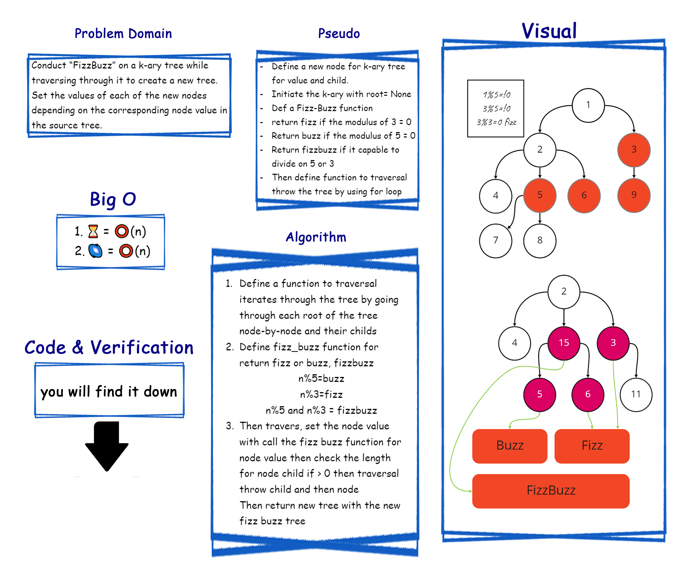

# Challenge Summary CC18

- [x] Write a function called fizz buzz tree
- [x] Arguments: k-ary tree
- [x] Return: new k-ary tree
- [x] Determine whether or not the value of each node is divisible by 3, 5 or both. Create a new tree with the same structure as the original, but the values modified as follows:
  - [x] If the value is divisible by 3, replace the value with “Fizz”
  - [x] If the value is divisible by 5, replace the value with “Buzz”
  - [x] If the value is divisible by 3 and 5, replace the value with “FizzBuzz”
  - [x] If the value is not divisible by 3 or 5, simply turn the number into a String.

## Efficiency
<!-- What is the Big O space/time for this approach? -->

- [x] ⏳ = ⭕(n)
- [x] 🌌 = ⭕(n)

## Whiteboard Process
<!-- Embedded whiteboard image -->

## Solution
<!-- Show how to run your code, and examples of it in action -->
### ▶ [Code](./tree_fizz_buzz/tree_fizz_buzz.py)

### ▶ [Verification](./tests/test_tree_fizz_buzz.py)
