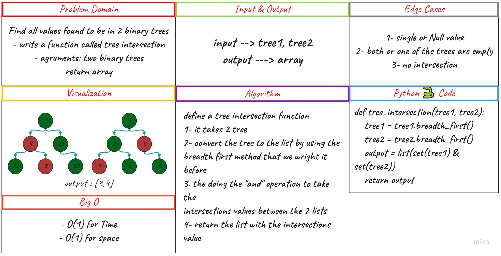

# Challenge Summary

Find common values in 2 binary trees.

## Whiteboard Process

## Approach & Efficiency

- [x] Find all values found to be in 2 binary trees

- [x] Write a function called tree intersection

- [x] Arguments: two binary trees
- [x] Return: array

## Efficiency

- O(1) for Time
- O(1) for space

## Solution

- **Code** : [python](./tree_intersection/code.py)
- **Test** : [test](./tests/test_tree_intersection.py)
